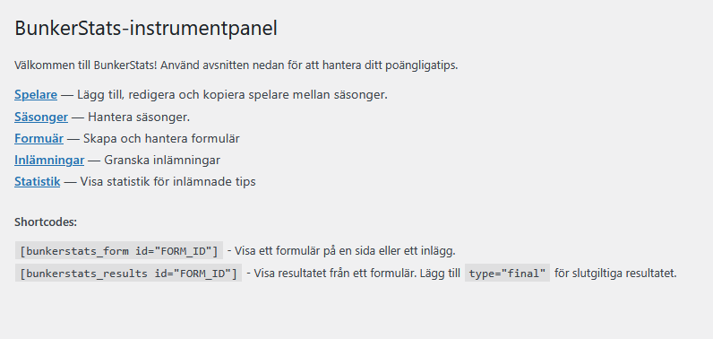
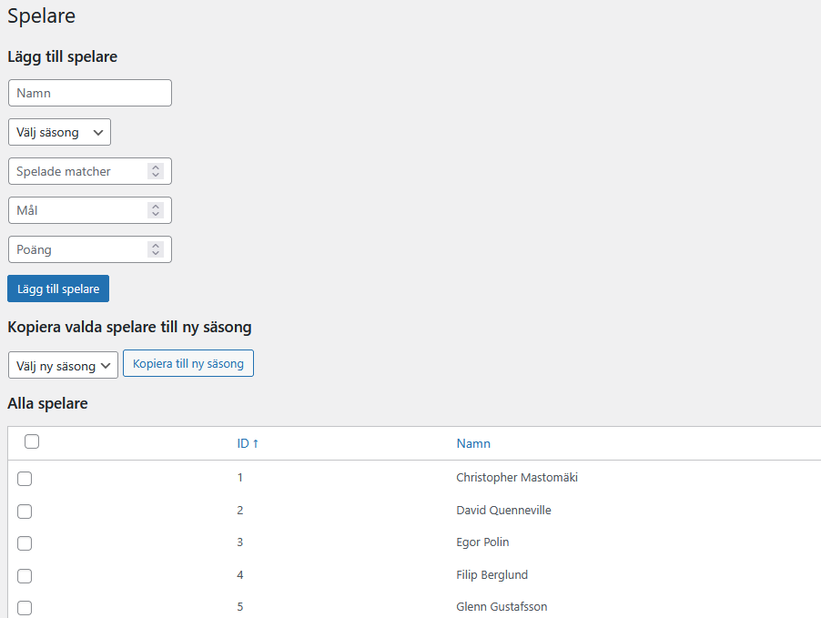
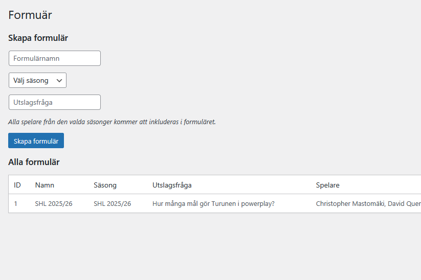
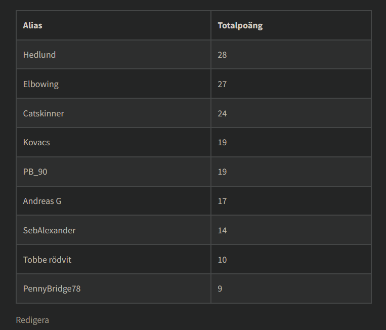
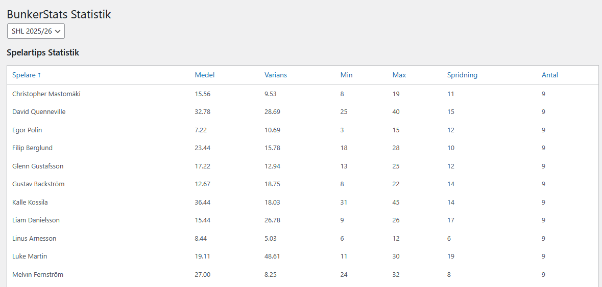

# BunkerStats

A WordPress plugin that allows readers to predict (guesstimate) the point totals of hockey players for a season.

## Features

- Add and manage players and seasons
- Create prediction forms for readers
- Readers can submit their guesses for each player
- Admin can view all submissions and edit them
- Statistics page with spread, average, and variance for each player
- Shortcodes to embed forms and results in posts/pages

## Shortcodes

- `[bunkerstats_form id="FORM_ID"]`  
  Display the prediction form for a given form id.

- `[bunkerstats_results id="FORM_ID"]`  
  Display the results table for a given form id.  
  Optional: `type="predicted"` or `type="final"`

## Admin Pages

- **Players:** Add, edit, and copy players between seasons
- **Seasons:** Manage seasons for your prediction games
- **Forms:** Create and manage prediction forms
- **Submissions:** View and review all user submissions
- **Statistics:** View summary statistics for all submissions

## Screenshots

## Installation

1. Upload the plugin files to the `/wp-content/plugins/bunkerstats` directory, or install the plugin through the WordPress plugins screen directly.
2. Activate the plugin through the 'Plugins' screen in WordPress.
3. Use the admin menu to add players, seasons, and forms.

## Localization

All user-facing strings are ready for translation.  
You can add your own translations in the `/languages` directory. You can use e.g. Poedit to make it easier for you.

## License

Apache 2.0

## Author

Andreas Galistel
